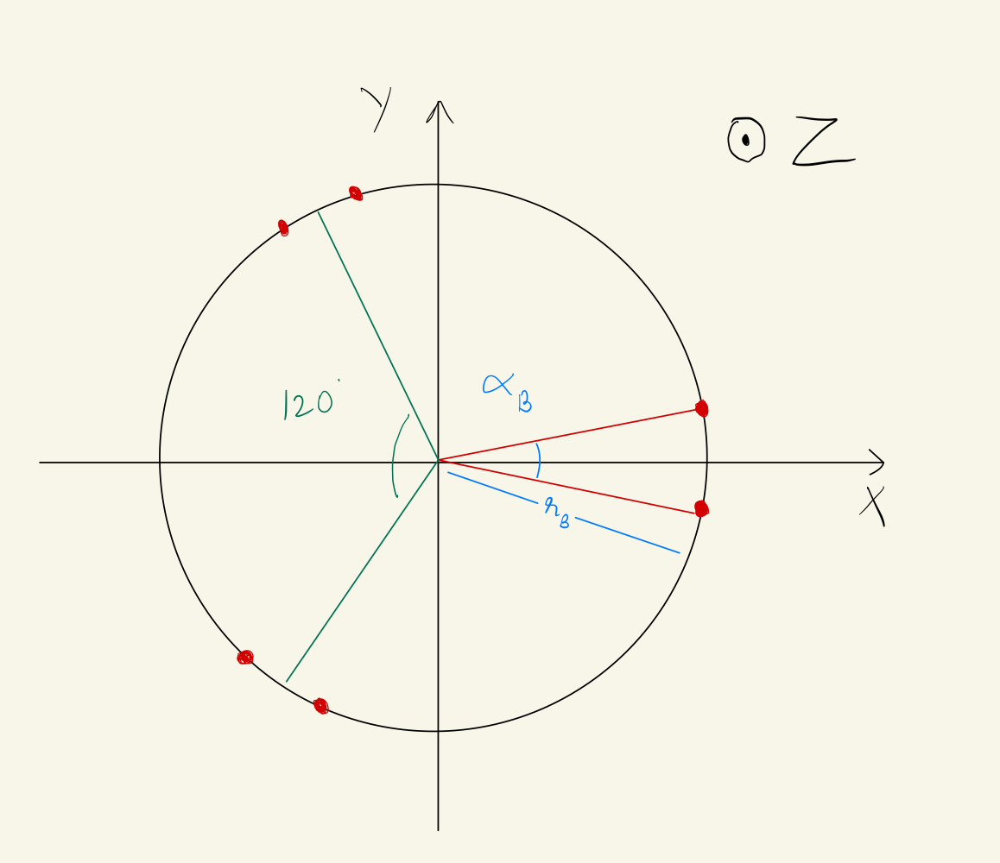

## Challenge 2 - DiamondAge 3D

**Author: Manuj Trehan**

### Dependencies
- Eigen3

```sudo apt install libeigen3-dev```

### Compile and run
- ```cd challenge2```
- ```g++ -I inc -I /usr/include/eigen3 src/StewartIK.cpp -o StewartIK.out```

- ```./StewartIK.out```
  
### Main
Some testing code is present inside the main function in ```StewartIk.cpp```

### Assumptions
1. The base and platform frame are aligned when the platform is at its home/retracted position (no relative rotation)
2. Axes: x pointing to the right, y pointing up, z pointing outwards
3. The base plate and platform plate thickness offsets are ignored
4. The platform is initialized in the home position
5. There is a 60 degree rotation offset between the platform and the base in the anti-clockwise direction about the z-axis
6. Number of degrees of freedom is fixed - 6
7. All actuators have the exact same retracted and extended length



- $\alpha_B$ is the anchor angle

- $r_B$ is the radius

### Discussion
I spent approximately 4.5 hrs on reading up on literature, solving the challenge and documenting my approach.

I created a ```StewartIK``` class for the inverse kinematics solver. It requires and stores the default system parameters, like the plate radius, anchor angles and actuator limits. It has methods for initialization, solving IK for a given 6-DoF pose, and getting the current actuator lengths, apart from some other helper functions.

**Difficulties with Forward Kinematics**

A Stewart platform is a parallel mechanism - it contians closed chain linkages, unlike a serial manipulator which is an open chain. Forward kinematics of open chains has closed-form solutions. Forward kinematics of closed chain linkages is complex because there are additional constraints that need to be satisfied, e.g. loop-closure constraints. Usually, multiple solutions exist for a single set of actuator lengths. For a 6-DoF platform, we need to map 6 leg lengths to a pose vector and a rotation matrix. This means a total of 12 equations and 12 unknowns (including the special orthogonal group constraints on the rotation matrix).

To overcome these challenges, I would use a numerical / iterative solver for the forward kinematics. One approach could be - utilizing the analytical inverse kinematics equation. Differentiating it to obtain an equation containing the leg velocities, and the inverse kinematics jacobian. This jacobian related the leg velocities to the twist of the platform. To calculate this Jacobian, a static force analysis can be performed. This will give us the inverse of the required Jacobian, which can then be utilized to perform forward kinematics. In an iterative approach, an initial estimate of the solution can be calculated and then iteratively improved upon, until convergence. A useful approach is using the previously known position of the platform as the initial guess for the iterative procedure, since it has high chances of converging to the correct solution. Checks can be done to discard invalid solutions as well.

### Challenges
It was a little difficult to thoroughly test my algorithm to see if it was giving the correct ouputs. One way to check would by through a simulation, but that was out of scope of this challenge.

### References

[1] https://www.xarg.org/paper/inverse-kinematics-of-a-stewart-platform/ \
[2] https://core.ac.uk/download/pdf/322824733.pdf